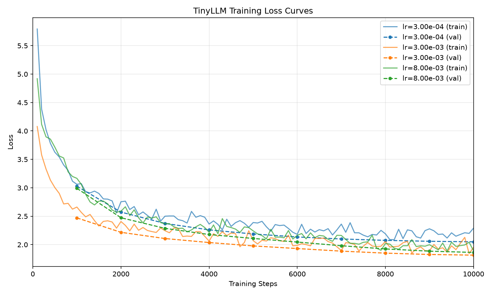

# Training and Inference Summary

## Training Experiments

Three models were trained on an Apple M1 Pro chip using the tiny architecture (~10M parameters), each trained for 10,000 steps (~5.5 hours) with default parameters and varying learning rates:

| Experiment | Learning Rate | Final Val Loss |
|------------|--------------|----------------|
| tiny-v2    | 3e-4         | ~2.05          |
| tiny-v3    | 3e-3         | ~1.80          |
| tiny-v4    | 8e-3         | ~1.95          |

The optimal learning rate was found to be approximately 3e-3, achieving the lowest validation loss and fastest convergence.

---

## Example Inferences

Here are some example story continuations with the strongest overall model (tiny-v3). 

Note that these continuations are truncated. The model generates multiple, unrelated, stories back-to-back. 

---

### Prompt
> The kids went to the forest. They saw a bear.

### Response
> The bear said, "I am sorry! I just wanted to play with you." The kids were happy and hugged the bear.
>
> From that day on, the boy and the friends played together every day. They made sure to have lots of fun adventures and not be lonely anymore.

---

### Prompt
> Max went to the park. He saw a big tree.

### Response
> Max walked up to the tree and said, "I want to swing on the branch!" Max was happy and said, "Yes, I want to swing too!"
>
> Max climbed up the tree and sat on it. His friend said, "You're so independent! Just be careful and don't run too high." Max felt happy and proud of himself.

---

### Prompt
> Lily was outside. It started raining. She wanted an umbrella.

### Response
> The rain stopped and the sun came out. The rain had blown away. Lily ran back inside to play.
>
> When it was time for bed, Lily took a nap. She dreamed about the rain outside. When she woke up, she felt so lucky that she couldn't wait to go outside again!
